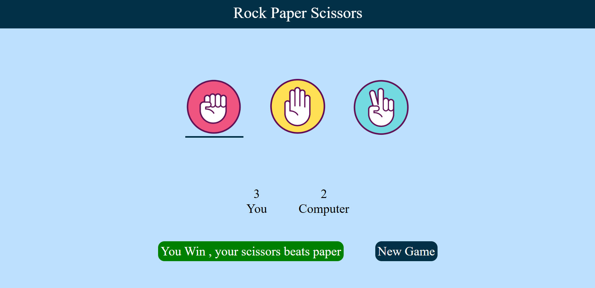

✊🖐️✌️ Rock Paper Scissors Game

The Rock Paper Scissors Game is a fun and interactive web project created using HTML, CSS, and JavaScript. It allows users to play the classic game against the computer, which makes random choices using JavaScript’s Math API. The game features a clean and responsive user interface where players can select their move — rock, paper, or scissors — and instantly see the result displayed on the screen. The logic determines the winner based on traditional game rules, while score tracking keeps users engaged. This project helped me strengthen my understanding of JavaScript functions, conditional statements, random number generation, and DOM manipulation. The use of animations and responsive design with CSS enhances the overall user experience. It’s a simple yet effective project that showcases my ability to combine logic, interactivity, and visual design in web development.

  

Live Website: https://akash8955.github.io/rock-paper-scissors/

